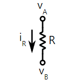

# Fluid Pipe Theory

## Intro

This document is here to introduce and elaborate on the concept of bringing fluid pipes with (mostly) incompressible fluids and reintroducing it as a nonlinear resistor in spicesharp so that a HVAC type simulator can be done.

## Converting Electrical Circuit Equations Into Fluid Equations

### Traditional SpiceSharp Calculations

In spicesharp, modified nodal analysis (MNA) is done over each node. Nodes here refer to the positive and negative terminals of the resistor. 

Positive terminals, often marked as node A, can be considered the "inlet" of the pipe, whereas negative terminals or node B, can be considered the "outlet" of the pipe.

This can be seen from the 
[example](https://spicesharp.github.io/SpiceSharp/articles/custom_components/example_resistor.html) here.


For most of the resistors, a current balance is performed both at the inlet and outlet of the pipe. The equations may be redundant at the end of the day, but the Solver objects automatically figure that out for you.

The job of the programmer is just to Program the resistor by performing current balance over the nodes.

For most nodes, current balance is being done. 

If voltage sources are introduced as in modified nodal analysis, then a fourth equation is put into the system of equations stating what the value of the voltage source is.


### Does Current Correspond to Mass Flowrate or Volumetric Flowrate?

Now, suppose we have current flow $i$, and voltage $V$. Current Flow is $\frac{Charge}{Time}$ while Voltage is $\frac{energy}{Charge}$.


Take the Product of both and we get

$$Power (watts) = iV = \frac{Charge}{Time}*\frac{Energy}{Charge}$$ 

Converting current into a mass or volumetric flowrate for fluids is a matter of replacing charge with volume or charge with mass.

Take Q = volumetric flowrate in $m^3/s$ and $\Delta P$ as pressure drop.

$$Power (watts) = Q*\Delta P = \frac{Volume}{Time}*\frac{Energy}{Volume}$$ 

We can see here that the pressure drop $\Delta P$ can be interpreted as loss 
in energy over the pipe per unit volume.

This is okay for a truly incompressible fluid, because one can 
simply replace Kirchov's current law, a current balance, 
with a volumetric flowrate balance.

But for a slightly compressible fluid, such that we want to have small expansions 
and contractions of liquids due to temperature differentials, those will not do.

Only a mass balance will work across the nodes no matter what. 
To convert the volumetric flowrate into mass flowrate,

We can multiple the numerator and denominator with density.
$$Power (watts) = Q\rho*\frac{\Delta P}{\rho} 
= \frac{mass}{Time}*\frac{Energy}{mass}$$ 

$$Power (watts) = \dot{m}*\frac{\Delta P}{\rho} = 
\frac{mass}{Time}*\frac{Energy}{mass}$$ 

The result is that current $i$ will correspond directly 
to mass flowrate $\dot{m} (kg/s)$ 
and voltage would correspond directly to kinematic pressure 
$\frac{\Delta P}{\rho}(m^2/s^2)$

Mass balance will always be consistent no matter the density, 
so this is physically more accurate and more intuitive mathematically.

Therefore, we will be doing mass balance equations over each node in place of current balance. It is a one to one replacement that does not require change of source code.


## Pipe Equations

In Perry's chemical engineering handbook, the formula used for 
fanning's friction factor by Churchill is:

$$f = 2 \left[\\
\left( \frac{8}{Re} \right)^{12} + \\
\left( \frac{1}{A+B}\right)^{3/2} \\
\right]^{1/12} $$
 
$$f = \frac{\Delta P}{ (\frac{4L}{D}) \  \frac{1}{2} \rho u^2 }$$
$$\Delta P = f  (\frac{4L}{D})  \frac{1}{2} \rho u^2 $$
\left( \frac{8}{Re} \right)^{12} + \\
\left( \frac{1}{A+B}\right)^{3/2} \\
\right]^{1/12} $$


The first term on the left represents the contribution by laminar flow regimes. 
For low reynolds numbers, B and A become really big. 
And so the right term becomes negligible.
The fanning friction factor reduces to $\frac{16}{Re}$ for Low reynolds numbers.


 
Where:

$$A = \left[ 2.457 \ln \frac{1}{\left( \frac{1}{(7/Re)^{0.9}} + \\
0.27 \frac{\varepsilon}{D} \right)} \\
\right]\ \ ; \ \ \\
B = \left( \frac{37530}{Re} \\ 
\right)^{16} $$


$$Re = \frac{ux}{\nu} = \frac{\rho u D}{\mu}$$ 

$$Re = \frac{\dot{m}D}{\mu A_{xs}}$$

Where $A_{XS}$ represents cross sectional area.
We can see that this is strongly non linear with respect to volumetric flowrate.

### From resistor current balance to pipe mass balance

note: i copied the image from 
[here](https://spicesharp.github.io/SpiceSharp/articles/custom_components/example_resistor.html)

In spicesharp, we perform current balance over node A, 
essentially the inlet and node B, essentially the outlet.

The voltage at A and B can represent the kinematic pressure at the inlet 
and outlet respectively.

For a relationship between mass flowrate and kinematic pressure respectively,
at least for circuits, Ohm's law is used. It is a neat, explicit linear
relationship.

$$\frac{v_A-v_B}{R}=i_R$$

For the relationship between mass flowrate and pressure, an equivalent
equation which, if Ohm's law is obeyed, should look like this

$$\frac{p_A (m^2/s^2) - p_B (m^2/s^2)}{R_{flow}} = \dot{m}_{pipe} (kg/s)$$

Unfortunately, the relationship between kinematic pressure and mass flowrate 
is hardly ever that simple.

For a laminar flow regime for example, f is conveniently $\frac{16}{Re}$

$$f = \frac{\Delta P}{ (\frac{4L}{D}) \  \frac{1}{2} \rho u^2 }$$

#### Laminar Regimes: Ohm's law is obeyed
Now let's substitute this value and use kinematic pressure (lowercase $p$) instead of dynamic pressure
$$\frac{16}{Re} = \frac{\Delta p}{ (\frac{4L}{D}) \  \frac{1}{2} u^2 }$$


$$Re = \frac{\dot{m}D}{\mu A_{xs}} = \frac{\rho u D}{\mu}$$
$$\frac{16\mu}{\rho u D} = \frac{\Delta p}{ (\frac{4L}{D}) \  \frac{1}{2} u^2 }$$
$$\frac{16\mu}{\rho  D} = \frac{\Delta p}{ (\frac{4L}{D}) \  \frac{1}{2} u }$$
$$\frac{64\mu (\frac{L}{D}) }{\rho  D} = \frac{\Delta p}{   \frac{1}{2} u }$$
$$\frac{64\mu L }{\rho  D^2} = \frac{\Delta p}{   \frac{1}{2} u }$$

We then relate $\dot{m} = \rho u A_{xs}\ ; u = \frac{\dot{m}}{\rho A_{xs}}$

$$\frac{64\mu L }{\rho  D^2} = \frac{\Delta p}{   \frac{1}{2} \frac{\dot{m}}{\rho A_{xs}} }$$

$$\frac{64\mu L\frac{1}{\rho A_{xs}}   \frac{1}{2}}{\rho  D^2} = \frac{\Delta p}{ \dot{m}  }$$

$$\frac{32\mu L   }{\rho^2 A_{xs}  D^2} = \frac{\Delta p}{ \dot{m}  }$$

For laminar flow essentially, Ohm's law is essentially obeyed and there is 
an explicit relationship.

For transitional and turbulent flow regimes, this law isn't obeyed.

[Moody Diagram [1]](#MoodyChart)

Here, the Darcy friction factor is used instead of fanning friction factor.

#### Fully Turbulent Regimes, Non Ohmic Resistor, but mass flowrate explicit

For rough pipes however, the friction factor becomes almost constant after 
a regime known as complete turbulence.

The friction factor becomes almost constant at this point. 
This regime is also commonly found in valves bends since the 
frictional losses are modelled by a constant loss coefficient.


For such a regime, 

$$K = \frac{\Delta p}{   \frac{1}{2} u^2 }$$


The kinematic pressure drop is nonlinear with respect to flow, but the 
expression of $\Delta p$ is still explicit with respect to flow.

Hence, finding flowrates as a function of pressure drops in this regime
is relatively trivial since we can just make mass flowrate $\dot{m}$
the subject of the equation.

$$\frac{1}{2}u^2 = \frac{\Delta p}{K}$$
$$u^2 = \frac{2\Delta p}{K}$$
$$u = \sqrt{\frac{2\Delta p}{K}}$$
$$\frac{\dot{m}}{\rho A_{xs}} = \sqrt{\frac{2\Delta p}{K}}$$
$$\dot{m} = \rho A_{xs}\sqrt{\frac{2\Delta p}{K}}$$

With this, explicit mass balances can still be formed and the jacobian
relatively easy to find, in the sense that explicit differentiation
can be done.

#### Non Explicit Non Linear Regimes

The last regime becomes the most challenging of all to tackle.

For one, we cannot quite obtain a value of mass flowrate explicitly from
the kinematic pressure drop. Thus, setting up our current balance 
equations can prove to be quite challenging.

However, from our [Moody Diagram [1]](#MoodyChart), we can obtain a kinematic
pressure drop explicitly from mass flowrate.

Because while the same friction factor can apply to two different 
Reynold's numbers, it is much harder for a pressure drop to 
apply to two different mass flowrates.

We can adopt the steps taken in the nonlinear resistor [example](https://github.com/SpiceSharp/SpiceSharp/blob/master/SpiceSharpTest/Examples/CustomResistor/BiasingBehavior.cs)

```csharp
void IBiasingBehavior.Load()
    {
        // First get the current iteration voltage
        var v = _nodeA.Value - _nodeB.Value;

        // Calculate the derivative w.r.t. one of the voltages
        var isNegative = v < 0;
        var c = Math.Pow(Math.Abs(v) / _bp.A, 1.0 / _bp.B);
        double g;

        // If v=0 the derivative is either 0 or infinity (avoid 0^(negative number) = not a number)
        if (v.Equals(0.0))
            g = _bp.B < 1.0 / _bp.A ? double.PositiveInfinity : 0.0;
        else
            g = Math.Pow(Math.Abs(v) / _bp.A, 1.0 / _bp.B - 1.0) / _bp.A;

        // In order to avoid having a singular matrix, we want to have at least a very small value here.
        g = Math.Max(g, _baseConfig.Gmin);

        // If the voltage was reversed, reverse the current back
        if (isNegative)
            c = -c;

        // Load the RHS vector
        c -= g * v;
        _elements.Add(
            // Y-matrix
            g, -g, -g, g,
            // RHS-vector
            c, -c);
    }

```

The steps are as follows: 
1. we are using the current iteration voltage (kinematic pressure drop) to
determine the current iteration's current (mass flowrate)
2. We then calculate the Jacobian
3. we use the jacobian to modify the current
4. load the Y matrix and RHS vector

Now the challenge here then is to calculate the Jacobian.

##### Calculating the Jacobian Numerically

Differentiating the Churchill formula here is not quite an option to obtain our
Jacobian.

$$\frac{\partial f_A}{\partial v_A}$$
$$\frac{\partial f_A}{\partial v_B}$$
$$\frac{\partial f_B}{\partial v_A}$$
$$\frac{\partial f_B}{\partial v_B}$$

The contributions to mass flowrate at node A (inlet) of this resistor is:

$$\dot{m}_{pipe}$$

And the contributions to mass flowrate at node B (outlet) 
of this resistor/pipe is:

$$-\dot{m}_{pipe}$$


Note that current outflow is positive by SpiceSharp [Conventions](https://spicesharp.github.io/SpiceSharp/articles/custom_components/example_resistor.html)

so the contributions by this nonlinear resistor to the jacobian are:

$$\frac{\partial i_R}{\partial v_A}$$
$$\frac{\partial i_R}{\partial v_B}$$

And likewise to node b,
$$-\frac{\partial i_R}{\partial v_A}$$
$$-\frac{\partial i_R}{\partial v_B}$$

Equivalently, for a pipe, this translates to:

$$\frac{\partial \dot{m}_{pipe}}{\partial p_A}$$
$$\frac{\partial \dot{m}_{pipe}}{\partial p_B}$$

And likewise to node b,
$$-\frac{\partial \dot{m}_{pipe}}{\partial p_A}$$
$$-\frac{\partial \dot{m}_{pipe}}{\partial p_B}$$

Problem here is we don't have an expression for current through the resistor
explicitly in terms of voltage.

However this we can exploit the fact that

$$\frac{d y}{d x} = \frac{1}{\frac{d x}{d y}}$$

This may help us. However, in terms of partial derivatives, this may or may not be
true.

Thankfully, for us, the only variables that we need concern 
ourselves with are the Reynolds number and the $\Delta p$ 
kinematic pressure drop.

It is relatively straightforward if one knows central difference
approximation to approximate this derivative
$$\frac{d \Delta p}{d Re}$$


Assuming all else is constant of course, like density and etc.

To obtain 

$$\frac{\partial \dot{m}_{pipe}}{\partial p_A}$$

we can make use of chain rule,

$$\frac{d \Delta p}{d Re} = \frac{d \Delta p}{d p_A}* \frac{d p_A}{d Re}$$

$$ = \frac{d \Delta p}{d p_A}* \frac{d p_A}{d \dot{m}_{pipe}} * \frac{d \dot{m}_{pipe}}{d Re} $$

Thus we can make $\frac{d p_A}{d \dot{m}_{pipe}}$ the subject

$$\frac{d p_A}{d \dot{m}_{pipe}} = \frac{\frac{d \Delta p}{d Re}}{\frac{d \Delta p}{d p_A} \frac{d \dot{m}_{pipe}}{d Re}}$$


To obtain the total derivative, we just flip it on its head

$$\frac{d \dot{m}_{pipe}}{d p_A} = \frac{\frac{d \Delta p}{d p_A} \frac{d \dot{m}_{pipe}}{d Re}}{\frac{d \Delta p}{d Re}}$$

To obtain the partial derivative, we just set $p_B$ as constant, 
and then work from there.

There's still one more step however, because the entire
equation is not properly set up in Re just yet.


$$f = \frac{\Delta P}{ (\frac{4L}{D}) \  \frac{1}{2} \rho u^2 }$$

There is in essence, a $\frac{1}{2}\rho u^2$ term that is not in terms of Re.

So we have to make the substitution

$$Re = \frac{\rho u D}{\mu}$$
$$u = \frac{Re \mu}{\rho D}$$

substituting this in results in:

$$f = \frac{\Delta P}{ (\frac{4L}{D}) \  
\frac{1}{2} \rho (\frac{Re \mu}{\rho D})^2 }$$

$$f * Re^2 = \frac{\Delta P}{ (\frac{4L}{D}) \  
\frac{1}{2} \rho (\frac{ \mu}{\rho D})^2 }$$


$$f * Re^2 = \frac{\Delta P}{ (\frac{4L}{D}) \  
\frac{1}{2} \rho (\frac{ \mu}{\rho D})^2 }$$


$$f * Re^2 = \frac{\Delta P}{ (\frac{4L}{D}) \  
\frac{1}{2} \rho (\frac{ \mu^2}{\rho^2 D^2}) }$$

Now if we were to substitute in kinematic pressure,
And i'll also explicitly note here that
f is a function of Re.

$$f (Re)* Re^2 = \frac{\Delta p}{ (\frac{4L}{D}) \  
\frac{1}{2}  (\frac{ \mu^2}{\rho^2 D^2}) }$$


$$f (Re)* Re^2 = \frac{\Delta p}{ (\frac{4L}{D}) \  
\frac{1}{2}  (\frac{ \nu^2}{ D^2}) }$$


Here we sort of have a collection of non-dimensionalised variables:

$$\frac{\Delta p}{\frac{\nu^2}{2D^2}}$$

$$\frac{4L}{D}$$


It appears that the initial dimensionless variable resembles the 
Bejan number closely.

The [Bejan Number](https://www.sciencedirect.com/science/article/abs/pii/S0735193321000075)
[[1]](#BejanNumber)
is a number that represents a sort of dimensionless pressure drop.

It was originally derived for heat transfer, but can just 
as easily apply for fluid mechanics.

It is defined for channel flow as

$$Be = \frac{\Delta p L^2}{\nu^2}
$$

where L is some channel length. We can see that this represents some
form of nondimensional pressure drop

so we can modify the following equation to include the Bejan number

$$f (Re)* Re^2 = \frac{\Delta p}{ (\frac{4L}{D}) \  
\frac{1}{2}  (\frac{ \nu^2}{ D^2}) }$$


$$f (Re)* Re^2 = \frac{\Delta p}{ (\frac{4L}{D}) \  
\frac{1}{2}  (\frac{ \nu^2}{L^2})\frac{L^2}{D^2} }$$

$$f (Re)* Re^2 = \frac{\Delta p L^2 /\nu^2}{ (\frac{4L}{D}) \  
\frac{1}{2}  \frac{L^2}{D^2} }$$


$$f (Re)* Re^2 = \frac{Be}{ (\frac{4L}{D}) \  
\frac{1}{2}  \frac{L^2}{D^2} }$$

$$f (Re)* Re^2 = \frac{Be}{ (\frac{4L}{D}) \  
\frac{16}{32}  \frac{L^2}{D^2} }$$

$$f (Re)* Re^2 = \frac{Be}{ (\frac{4L}{D})^3 \  
\frac{1}{32}   }$$

$$f (Re)* Re^2 = \frac{32 Be}{ (\frac{4L}{D})^3 
}$$

From this we can find the differential 

$$\frac{d(Be)}{d(Re)}  = \frac{d(Be)}{d \Delta p} * \frac{d \Delta p}{d (Re)}
$$

With this, we can start finding 
$$\frac{d(Be)}{d(Re)}  = \frac{d}{d(Re)} (f(Re)*Re^2)$$ 

$$f = 2 \left[\\
\left( \frac{8}{Re} \right)^{12} + \\
\left( \frac{1}{A+B}\right)^{3/2} \\
\right]^{1/12} $$

we could tackle this with product rule, or simply multiply
the $Re^2$ term into Churchull's correlation

$$(f(Re)*Re^2) = 2 \left[\\
\left( \frac{8}{Re} \right)^{12} + \\
\left( \frac{1}{A+B}\right)^{3/2} \\
\right]^{1/12} Re^2 $$


$$(f(Re)*Re^2) = 2 \left[\\
\left( \frac{8}{Re} \right)^{12} + \\
\left( \frac{1}{A+B}\right)^{3/2} \\
\right]^{1/12} (Re^{24})^{1/12} $$


$$(f(Re)*Re^2) = 2 \left[\\
\left( \frac{8}{Re} \right)^{12} Re^{24} + \\
\left( \frac{1}{A+B}\right)^{3/2} Re^{24}\\
\right]^{1/12}  $$

$$(f(Re)*Re^2) = 2 \left[\\
\left( \frac{8}{Re} \right)^{12} (Re^{2})^{12} + \\
\left( \frac{1}{A+B}\right)^{3/2} Re^{24}\\
\right]^{1/12}  $$

$$(f(Re)*Re^2) = 2 \left[\\
\left( \frac{8}{Re}*Re^2 \right)^{12}  + \\
\left( \frac{1}{A+B}\right)^{3/2} Re^{24}\\
\right]^{1/12}  $$


$$(f(Re)*Re^2) = 2 \left[\\
\left( 8 Re \right)^{12}  + \\
\left( \frac{1}{A+B}\right)^{3/2} Re^{24}\\
\right]^{1/12}  $$


$$(f(Re)*Re^2) = 2 \left[\\
\left( 8 Re \right)^{12}  + \\
\left( \frac{1}{A+B}\right)^{3/2} (Re^{16})^{3/2}\\
\right]^{1/12}  $$

$$(f(Re)*Re^2) = 2 \left[\\
\left( 8 Re \right)^{12}  + \\
\left( \frac{Re^{16}}{A+B}\right)^{3/2} \\
\right]^{1/12}  $$

Now Differentiating this analyticaly needs a few steps

First i will want to substitute the term in the inner
brackets with G1 


$$ \frac{d}{d(Re)}(f(Re)*Re^2) = \frac{d}{d(Re)}2 (G1)^{1/12}  $$

$$G1  = \left[\\
\left( 8 Re \right)^{12}  + \\
\left( \frac{Re^{16}}{A+B}\right)^{3/2} \\
\right]$$


$$ \frac{d}{d(Re)}(f(Re)*Re^2) = 2\frac{d}{d(Re)} (G1)^{1/12}  $$
$$ \frac{d}{d(Re)}(f(Re)*Re^2) = 2 \frac{1}{12}
\frac{d (G1)}{d(Re)} (G1)^{1/12} 
* \frac{1}{G1}  $$


$$ \frac{d}{d(Re)}(f(Re)*Re^2) =  \frac{1}{6}
\frac{d (G1)}{d(Re)} (G1)^{1/12} 
* \frac{1}{G1}  $$

From here I want two functions, (1) a function returning the value of G1,
(2) a function returning the value of dG1_dRe


The next challenge will be to differentiate dG1_dRe


$$\frac{d}{d(Re)}G1  =\frac{d}{d(Re)} \left[\\
\left( 8 Re \right)^{12}  + \\
\left( \frac{Re^{16}}{A+B}\right)^{3/2} \\
\right]$$

The first term is quite straightforward

$$\frac{d}{d(Re)}G1  = 8(12) Re^{11}  + \frac{d}{d(Re)} \left[\\
\left( \frac{Re^{16}}{A+B}\right)^{3/2} \\
\right]$$


The second term shall be dealt with using substitution first.


$$\frac{d}{d(Re)}G1  = 8(12) Re^{11}  + \frac{3}{2}
\left( \frac{Re^{16}}{A+B}\right)^{1/2}  \frac{d}{d(Re)}
\left( \frac{Re^{16}}{A+B}\right) \\
$$

Then now we can start using the quotient rule

$$\frac{d}{d(Re)}G1  = 8(12) Re^{11}  + \frac{3}{2}
\left( \frac{Re^{16}}{A+B}\right)^{1/2}  \frac{d}{d(Re)}
\left( \frac{Re^{16}}{A+B}\right) \\
$$

$$\frac{d}{d(Re)}G1  = 8(12) Re^{11}  + \frac{3}{2}
\left( \frac{Re^{16}}{A+B}\right)^{1/2}  
\left( \frac{Re^{16}\frac{d}{d(Re)} (A+B)+ (A+B) 16 Re^{15}}{(A+B)^2}\right) \\
$$

We note the term $A+B$ appears repeatedly, so a 
dedicated function should be there to return
APlusB

Also, dAPlusB will also be returned via another function

Now let's calculate dAPlusB

$$\frac{d}{d(Re)}(A+B)$$

$$A = \left[ 2.457 \ln \frac{1}{\left( \frac{1}{(7/Re)^{0.9}} + \\
0.27 \frac{\varepsilon}{D} \right)} \\
\right]\ \ ; \ \ \\
B = \left( \frac{37530}{Re} \\ 
\right)^{16} $$


Now first, we shall reduce them to more palatable forms:

Using the power law of lograithms,

$$A = -2.457 * ln \left( \frac{Re^{0.9}}{7^{0.9}} 
+ 0.27 \frac{\varepsilon}{D} \right)$$

For this, we would like to define G2 as follows:

$$G2 = \left( \frac{Re^{0.9}}{7^{0.9}} 
+ 0.27 \frac{\varepsilon}{D} \right)$$

So that
$$\frac{dA}{d(Re{})} = \frac{-2.457}{G2} \frac{dG2}{d(Re)} $$

So now we will have two functions, G2 and dG2_dRe to return their
appropriate values

For the derivative dG2_dRe, we shall assume the diameter D
does not change during the course of channel flow.

Thus during the iterations, D can be assumed to be constant.
This is an important assumption. 

However, we can also take it from this standpoint:


$$\frac{d}{d(Re)}G2 = \frac{d}{d(Re)}\left( \frac{Re^{0.9}}{7^{0.9}} 
+ 0.27 \frac{\varepsilon}{D} \right)$$


The change in relative roughness can be assumed to be small or
negligible when Re changes. Even when the pipe expands and 
contracts during flow, it is small.

I will not go in depth trying the prove this, though it can
be proven so. that the surface roughness ratio does not change
significantly compared to change in Re during flow conditions.


$$\frac{d}{d(Re)}G2 = \frac{d}{d(Re)}\left( \frac{Re^{0.9}}{7^{0.9}} 
\right)$$


$$\frac{d}{d(Re)}G2 = 
0.9* \frac{1}{Re} \left( \frac{Re^{0.9}}{7^{0.9}} 
\right)$$


$$\frac{d}{d(Re)}G2 = 
 \frac{0.9}{Re} \left( \frac{Re^{0.9}}{7^{0.9}} 
\right)$$


$$\frac{d}{d(Re)}G2 = 
 \frac{0.9}{7^{0.9}Re^{0.1{}}} $$


 Now let's consider B also, lest we forget

$$B = \left( \frac{37530}{Re} \\ 
\right)^{16} $$

$$B = 37530^{16} * Re^{-16} $$

$$\frac{dB}{d(Re)} = 37530^{16}*(-16)*Re^{-17} $$

$$\frac{dB}{d(Re)} = 37530^{16}*(\frac{-16}{Re})*Re^{-16} $$

$$\frac{dB}{d(Re)} = -B*(\frac{16}{Re}) $$


Now with these quantities found, we can start programming in the
C# code which returns the following values

Now this is a multistep process, and it WILL need testing.


#### Testing of the derivative


So what is best for now is to test it with a simple use case first.

I want to check a mass flowrate given a pressure drop.

Or at least a friction factor given a Reynold's number.

What i probably want to do is this: 

1. Test for friction factor using Re
2. Supply a friction factor, and extract Re in return (actually this 
 will be pretty 
problematic), because the moody chart has two values of Re 
factor for a single value of friction factor,
 this would happen for Re<10,000. 
3. To modify test 1 and 2, convert the moody chart to a Bejan number 
vs Re chart. Test if this corresponds to an unconverted form
and then use it as the reference

The next trick is to obtain Re given a Bejan Number.

But a simple 1D Newton Raphson method would suffice.

For this, we just use the iterative equation

$$\frac{d f(x)}{dx} (x_{i+1} - x_i) = -f(x)$$

$$\frac{d f(x)}{dx} (x_{i+1} ) = -f(x) + \frac{d f(x)}{dx} x_i$$

$$f (Re)* Re^2 = \frac{32 Be}{ (\frac{4L}{D})^3 
}$$


For the newton Raphson method here, we first need to supply a Bejan
Number and a given 4L/D value.

Once that is done


$$f_{newtonRaphson}(Re) = f (Re)* Re^2 - 
\frac{32 Be}{ (\frac{4L}{D})^3}$$

This value is then set to zero. Reynold's numbers will be guessed
iteratively until completion.


For testing, it would be prudent to compare the analytical derivation
to a numerical derivation of the actual function using some
predefined libraries for a range of reynold's numbers
over a range of roughness ratios, this can be done using xUnit
Using Theory tests

From a testing standpoint, it's sometimes better to analytically 
differentiate it so that instead of relying solely on numerical
differentiation, there are now two methods with which i can
check the friction factor.

Also of course, i'l like to test against the moody chart. That's
the best test.


## Bibiliography 
<a id="MoodyChart">
[1]
 Fanning friction factor. Nuclear Power. (2021, October 25). Retrieved June 3, 2022, from https://www.nuclear-power.com/nuclear-engineering/fluid-dynamics/major-head-loss-friction-loss/fanning-friction-factor/ 
</a>

<a id="BejanNumber">
[2]
Zimparov, V. D., Angelov, M. S., & Hristov, J. Y. (2021). Critical review of the definitions of the Bejan number-first law of thermodynamics. International Communications in Heat and Mass Transfer, 124, 105113.</a>


