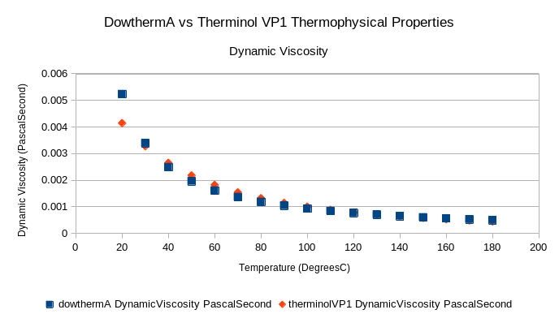

# therminolPipeTest

The goal of this series of tests is ensure that the therminolPipe
abstract class works.

Only when the therminolPipe abstract class works, then it can
serve as a suitable base class for all the other components
in the compact integral effects test.

Note here that whenever i refer to therminol as if it were
a heat transfer oil, i am referring exclusively to therminol VP-1.

I would use those terms interchangably here.


# Therminol Fluid Object tests

The TherminolPipe abstract class uses the coolprop libraries 
in order to extract data for the fluid properties in the
therminol pipe. 

To ensure that it is working properly, the first set of tests
is to see if the therminol fluid functions have the same 
thermophysical property values as the values given by the vendor.

[Data](https://www.eastman.com/Literature_Center/T/TF9141.pdf)
from the vendor will be compared against the data from the 
therminol fluid object. If things work out then great!

## Therminol VP1 vs Dowtherm A tests

Now therminol is very chemically similar to dowtherm A. However
some of the properties might differ slightly due to chemical
composition etc.

It is important to see if therminol VP-1 and dowtherm A have 
similar properties compared to flibe at the same scaled
temperature ranges. If not, it may be prudent to have one 
set of pipes having a therminol fluid inside, and one set of pipes
having dowtherm A fluid.

The most important property to compare perhaps is the Prandtl
number at certain temperatures. The Dowtherm A correlations
obtaining the Prandtl number should be compared to the therminol
VP1 numbers. 

If the matches are close enough, we should be able to use 
therminol VP-1 for CIET.

It is probably quite important to compare these two quantities
on a graph and quantify the difference between therminol VP1 
and dowtherm A.

## Therminol Pipe Feature Tests

Once we ascertain that therminol is close enough to Dowtherm A
in terms of thermophysical properties, we can start putting the
therminol pipes to certain tests.

Before we start testing them in nested cases, we need to check if
therminol pipes perform as expected.

eg. 

1. If we change Temperature, do properties change as expected
2. If we change fluid pressure, do properties stay constant?
3. If we change elevation, does the pipe produce the correct
hydrostatic pressure?
4. If we change pressure drop, does the pipe have expected Re
behavior?
5. If we change elevation, does the pipe change the accumulated
height? and Produce the correct coordinate change?

With these, we can then have some level of confidence that
our therminolPipe abstract class works.

## Results for Therminol Pipe temperature variability tests

I created an abstract class therminol pipe with partially 
implemented methods for Pr, $\mu$, Cp, k and $\rho$.

The abstract class cannot be instantiated on its own, so i
created a mockTherminolPipe class with which to instantiate 
the class. The implementation for all abstract classes are
throw new NotImplementedException().

I varied the temperature from 20C to 180C and saw that the
mockTherminolPipe was able to return all the quantities correctly
in comparison to the underlying coolprop libraries.

## Results for Therminol and Dowtherm A Properties comparison.

Dowtherm A and therminol VP1 are very close in composition
and chemical properties. Nevertheless, it is prudent to ascertain
how much their properties differ, especially the prandtl number.

However, we also want to compare the dynamic viscosity, density,
kinematic viscosity, heat capacity and thermal conductvity at
different temperatures. 

Also perhaps compare the percentage differences between Re of
Dowtherm and Re of Therminol at different temperatures and see
the error.

The correlations used in Dowtherm A are as follows (valid for 20-180C):

Density:
$$\rho (kg/m^23) = 1078-0.85*T(C)$$

Dynamic Viscosity
$$\mu (Pa \ s)= \frac{0.130}{T^{1.072} (C)}$$


Specific Heat Capacity
$$Cp(\frac{J}{kg \ K}) = 1518 + 2.82*T(C)$$


Thermal Conductivity:
$$k (\frac{W}{m K}) = 0.142 - 0.00016 * T(C)$$

### Prandtl Number

For most temperatures, the Prandtl number of Therminol VP1 is within
15% of Dowtherm A. For 80-160C, error is less than 10%.

But we have one big outlier in the data point at 20C, where error is
21%.

$$error = \frac{|Pr_{dowthermA}-Pr_{TVP1}|}{PR_{dowthermA}} *100%$$


### Density

The maximum error here is 0.651%, density data is almost equal for
both Dowtherm A and Therminol VP 1.


Error fromula is similar to prandtl number error, ie the dowtherm A 
property is in the denominator.
### Dynamic Viscosity

Dynamic viscosity has a 21% error at 20C but from 90C to 180C, the
viscosity has a 10% discrepancy compared to dowtherm A. 

And for the rest of the temperatures, it is within 13%.




Error fromula is similar to prandtl number error, ie the dowtherm A 
property is in the denominator.


### Specific Heat Capacity

The max error here is 2%. But therminol VP1 is consistently 2% below
dowtherm A.


Error fromula is similar to prandtl number error, ie the dowtherm A 
property is in the denominator.

### Thermal Conductivity

The max error here is 3.3%.

Below 60C, Dowtherm A has a higher thermal conductivity than Therminol 
VP1. Above 60C, therminolVP1 has a higher thermal conductivity than
Dowtherm A.


# Basic Pipe Functionality Tests

I also conduct basic tests for my therminol pipe here.

I need to make sure the code is functioning as intended, not exactly heavy
theory here.


## Methodology

TherminolPipe is an abstract class, which means i cannot instantiate it without
first getting another class to inherit from it. It is somewhere in between
an interface and a full class. There is partial implementation, but the rest
is up to the user.

I make a mockTherminolPipe which does not implement new methods, but just
sets simple pipe parameneters like pipe length and diameter, etc, so i can
start testing if the class works.k

## Are my thermodynamic functions working correctly?

I will have several functions within my therminolPipe class, one to calculate
heat capacity, one for thermal conductivity, one for viscosity and one for
density. One also for Pr. These are temperature dependent, and i need to make
sure these give the same output as when i use the sharpFluids code.

```csharp
// here i need to test the therminol pipe abstract class for five things
// 1) double Pr
// 2) SpecificHeatCapacity Cp
// 3) Density rho
// 4) DynamicViscosity mu
// 5) ThermalConductivity k
//
// Test (1/5)
[Theory]
[InlineData(20)]
[InlineData(30)]
[InlineData(40)]
[InlineData(50)]
[InlineData(60)]
[InlineData(70)]
[InlineData(80)]
[InlineData(90)]
[InlineData(100)]
[InlineData(120)]
[InlineData(130)]
[InlineData(140)]
[InlineData(150)]
[InlineData(160)]
[InlineData(170)]
[InlineData(180)]
public void WhenAbstractTherminolPipeTemperatureVariedExpectPrandtl(
        double tempCValue){
    // this test checks if the functions returning prandtl number
    // from the therminol pipe abstract class 
    // will return the correct prandtl number
    
    
    // Setup
    Fluid therminol = new Fluid(FluidList.InCompTherminolVP1);
    Pressure referencePressure = new Pressure(1.013e5, PressureUnit.Pascal);
    EngineeringUnits.Temperature testTemperature;
    testTemperature = new EngineeringUnits.
        Temperature(tempCValue, TemperatureUnit.DegreeCelsius);

    therminol.UpdatePT(referencePressure, testTemperature);
    double referencePrandtlNumber = therminol.Prandtl;
    double testPrandtlNumber;
    // let's make  a mockTherminolPipe which inherits from the 
    // therminolPipe Abstract class but implements all methods with
    // throw new NotImplementedException()

    TherminolPipe testPipe = new mockTherminolPipe("mockTherminolPipe",
            "0","out");

    testPrandtlNumber = testPipe.getFluidPrandtl(testTemperature);

    // Act


    // Assert
    //
    Assert.Equal(referencePrandtlNumber, testPrandtlNumber);

}
```

I do tests for all five quantities, Pr, Cp, mu, k and rho. Which are
Prandtl number, SpecificHeatCapcity, dynamic viscosity, thermal conductivity
and density.

These tests pass so i'm comfortable.

## Is my nodalisation working correctly?

I have seen in SAM that pipes are discretised into finite volumes or nodes
to facilitate heat transfer calculations.

When nodalisation comes, there are two considerations at least. Firstly is
courant number, is my timestep short enough to ensure Co<1?.

But more of concern here is that my nodalisation code is working correctly.

By default, i just want the end user to specify how many segments there are
in the pipe, and the therminolPipe class will then cut the pipe up into
equal segments.

To test if it's working correctly, i use this test:

```csharp
[Fact]
public void WhenNumberOfNodesSetExpectEqualLength(){

    // Setup
    TherminolPipe testPipe = 
        new mockTherminolPipe("mockTherminolPipe", "0","out");

    testPipe.componentLength = new Length(1.0, LengthUnit.Meter);
    testPipe.numberOfSegments = 10;
    // now let's retrieve the length list

    IList<Length> testPipeLengthList = new List<Length>();

    foreach (Length segmentLength in testPipe.lengthList)
    {
        testPipeLengthList.Add(segmentLength);
    }

    // so let me just get the first length off this list
    Length firstLength = testPipeLengthList[0];

    // Act

    // then i'll go through a for loop whether the legnths are
    // equal, if equal i will add to an integer known as the checksum
    // if the interger in the checksum is equal to the 
    // number of nodes, then the test passes
    //
    int checksum = 0;

    foreach (Length segmentLength in testPipeLengthList)
    {
        if(firstLength.As(LengthUnit.Meter) ==
                segmentLength.As(LengthUnit.Meter)){
            checksum++;
        }

    }
    // Assert
    //
    Assert.Equal(testPipe.numberOfSegments,checksum);
}
```

The test works so im ok.

Next, i want to find out if i set a number of nodes, is the length of
each segment equal to the total length divided by the number of segments:

```csharp

[Theory]
[InlineData(5,1.0)]
[InlineData(50,10.0)]
[InlineData(70,1.0)]
[InlineData(1,2.0)]
public void WhenNumberOfNodesSetLengthEqual1dividebyNoOfSegments(
        int numberOfSegments, double componentLength){

    // Setup
    TherminolPipe testPipe = 
        new mockTherminolPipe("mockTherminolPipe", "0","out");

    testPipe.componentLength = new Length(componentLength, LengthUnit.Meter);
    testPipe.numberOfSegments = numberOfSegments;
    Length expectedLength = testPipe.componentLength/numberOfSegments;
    // now let's retrieve the length list

    IList<Length> testPipeLengthList = new List<Length>();

    foreach (Length segmentLength in testPipe.lengthList)
    {
        testPipeLengthList.Add(segmentLength);
    }

    // so let me just get the first length off this list
    Length firstLength = testPipeLengthList[0];

    // Act

    // then i'll go through a for loop whether the legnths are
    // equal, if equal i will add to an integer known as the checksum
    // if the interger in the checksum is equal to the 
    // number of nodes, then the test passes
    //

    foreach (Length segmentLength in testPipeLengthList)
    {
        // now i know for each length i'm not supposed to use
        // so many assert.Equal in one test
        // but i want the test to fail if even one of the lengths 
        // isn't equal, so that's why i do it this way
        // the lazy way
        Assert.Equal(expectedLength.As(LengthUnit.Meter),
                segmentLength.As(LengthUnit.Meter));
    }
    // Assert
    //
}
```
test passed, ok

Next, is some execptions to warn the user, I cannot have 0 or less than 0
segments. 
So i want a dividebyZeroException thrown when the user gives this value

```csharp

[Theory]
[InlineData(0)]
[InlineData(-1)]
public void WhenZeroSegmentsSetExpectDivideByZeroException(
        int numberOfSegments){

    // Setup
    TherminolPipe testPipe = 
        new mockTherminolPipe("mockTherminolPipe", "0","out");

    testPipe.componentLength = new Length(10.0, LengthUnit.Meter);

    Assert.Throws<DivideByZeroException>(() => 
            testPipe.numberOfSegments = numberOfSegments);

}
```
test passed, i'm ok. Not exactly the best exception name, but it will
do for now


Next thing to do are diameter tests.

Basically when I have a pipe of differing entrance and exit diameters,
I want the code to linearly interpolate hydraulic diameters along the pipe.

This can be overridden by the user.

But i want the functionality.

The first test of these is a base case, if i set both entrance and exit
hydraulic diameter to be equal, the hydraulic diameter along the whole
pipe should be the same.

```csharp


[Theory]
[InlineData(5,1.0)]
[InlineData(50,10.0)]
[InlineData(70,1.0)]
[InlineData(1,2.0)]
public void WhenNumberOfNodesSetExpectCorrectSegmentLength(
        int numberOfSegments, double componentLength){

    // Setup
    TherminolPipe testPipe = 
        new mockTherminolPipe("mockTherminolPipe", "0","out");

    testPipe.componentLength = new Length(componentLength, LengthUnit.Meter);
    // Act
    testPipe.numberOfSegments = numberOfSegments;

    Length expectedDiameter = testPipe.entranceHydraulicDiameter;

    IList<Length> diameterList = testPipe.hydraulicDiameterList;

    // Assert
    foreach (Length diameter in diameterList)
    {
        Assert.Equal(expectedDiameter.As(LengthUnit.Meter)
                , diameter.As(LengthUnit.Meter));
    }

}
```
Test passed, i'm ok

The next test checks if there are a correct number of hydraulic diameters
within the list of hydraulic diameters along the pipe length.
```csharp

[Theory]
[InlineData(5,1.0,1.5)]
[InlineData(50,10.0,2.0)]
[InlineData(70,1.0,0.5)]
[InlineData(1,2.0,0.9)]
public void WhenUnequalDiametersSetExpectCorrectCount(
        int numberOfSegments, double componentLength,
        double expansionRatio){

    // Setup
    TherminolPipe testPipe = 
        new mockTherminolPipe("mockTherminolPipe", "0","out");

    testPipe.componentLength = new Length(componentLength, LengthUnit.Meter);

    // Act
    testPipe.numberOfSegments = numberOfSegments;

    testPipe.exitHydraulicDiameter = testPipe.entranceHydraulicDiameter *
        expansionRatio;


    IList<Length> diameterList = testPipe.hydraulicDiameterList;

    Assert.Equal(numberOfSegments,diameterList.Count);

}
```
Test passed, i'm ok.


