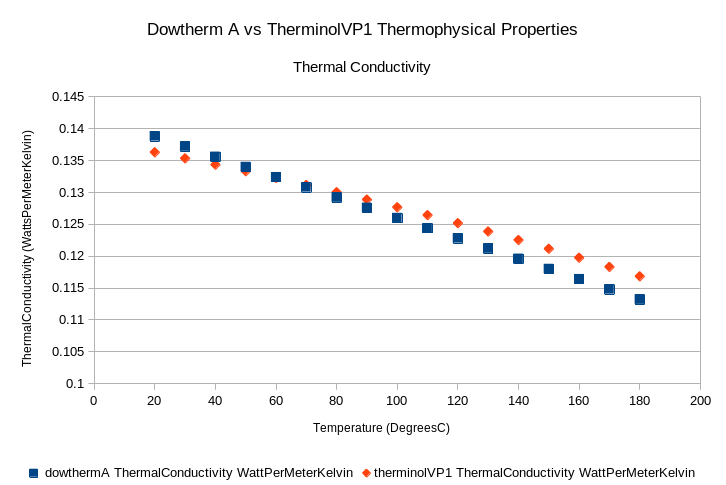

# therminolPipeTest

The goal of this series of tests is ensure that the therminolPipe
abstract class works.

Only when the therminolPipe abstract class works, then it can
serve as a suitable base class for all the other components
in the compact integral effects test.

Note here that whenever i refer to therminol as if it were
a heat transfer oil, i am referring exclusively to therminol VP-1.

I would use those terms interchangably here.

## Therminol Fluid Object tests

The TherminolPipe abstract class uses the coolprop libraries 
in order to extract data for the fluid properties in the
therminol pipe. 

To ensure that it is working properly, the first set of tests
is to see if the therminol fluid functions have the same 
thermophysical property values as the values given by the vendor.

[Data](https://www.eastman.com/Literature_Center/T/TF9141.pdf)
from the vendor will be compared against the data from the 
therminol fluid object. If things work out then great!

## Therminol VP1 vs Dowtherm A tests

Now therminol is very chemically similar to dowtherm A. However
some of the properties might differ slightly due to chemical
composition etc.

It is important to see if therminol VP-1 and dowtherm A have 
similar properties compared to flibe at the same scaled
temperature ranges. If not, it may be prudent to have one 
set of pipes having a therminol fluid inside, and one set of pipes
having dowtherm A fluid.

The most important property to compare perhaps is the Prandtl
number at certain temperatures. The Dowtherm A correlations
obtaining the Prandtl number should be compared to the therminol
VP1 numbers. 

If the matches are close enough, we should be able to use 
therminol VP-1 for CIET.

It is probably quite important to compare these two quantities
on a graph and quantify the difference between therminol VP1 
and dowtherm A.

## Therminol Pipe Feature Tests

Once we ascertain that therminol is close enough to Dowtherm A
in terms of thermophysical properties, we can start putting the
therminol pipes to certain tests.

Before we start testing them in nested cases, we need to check if
therminol pipes perform as expected.

eg. 

1. If we change Temperature, do properties change as expected
2. If we change fluid pressure, do properties stay constant?
3. If we change elevation, does the pipe produce the correct
hydrostatic pressure?
4. If we change pressure drop, does the pipe have expected Re
behavior?
5. If we change elevation, does the pipe change the accumulated
height? and Produce the correct coordinate change?

With these, we can then have some level of confidence that
our therminolPipe abstract class works.

## Results for Therminol and Dowtherm A Properties comparison.

Dowtherm A and therminol VP1 are very close in composition
and chemical properties. Nevertheless, it is prudent to ascertain
how much their properties differ, especially the prandtl number.

However, we also want to compare the dynamic viscosity, density,
kinematic viscosity, heat capacity and thermal conductvity at
different temperatures. 

Also perhaps compare the percentage differences between Re of
Dowtherm and Re of Therminol at different temperatures and see
the error.

The correlations used in Dowtherm A are as follows (valid for 20-180C):

Density:
$$\rho (kg/m^23) = 1078-0.85*T(C)$$

Dynamic Viscosity
$$\mu (Pa \ s)= \frac{0.130}{T^{1.072} (C)}$$

Specific Heat Capacity
$$Cp(\frac{J}{kg \ K}) = 1518 + 2.82*T(C)$$

Thermal Conductivity:
$$k (\frac{W}{m K}) = 0.142 - 0.00016 * T(C)$$

### Prandtl Number

For most temperatures, the Prandtl number of Therminol VP1 is within
15% of Dowtherm A. For 80-160C, error is less than 10%.

But we have one big outlier in the data point at 20C, where error is
21%.

$$error = \frac{|Pr_{dowthermA}-Pr_{TVP1}|}{PR_{dowthermA}} *100%$$

### Density

The maximum error here is 0.651%, density data is almost equal for
both Dowtherm A and Therminol VP 1.

Error fromula is similar to prandtl number error, ie the dowtherm A 
property is in the denominator.
### Dynamic Viscosity

Dynamic viscosity has a 21% error at 20C but from 90C to 180C, the
viscosity has a 10% discrepancy compared to dowtherm A. 

And for the rest of the temperatures, it is within 13%.

Error fromula is similar to prandtl number error, ie the dowtherm A 
property is in the denominator.

### Specific Heat Capacity

The max error here is 2%. But therminol VP1 is consistently 2% below
dowtherm A.

Error fromula is similar to prandtl number error, ie the dowtherm A 
property is in the denominator.

### Thermal Conductivity

The max error here is 3.3%.

Below 60C, Dowtherm A has a higher thermal conductivity than Therminol 
VP1. Above 60C, therminolVP1 has a higher thermal conductivity than
Dowtherm A.

